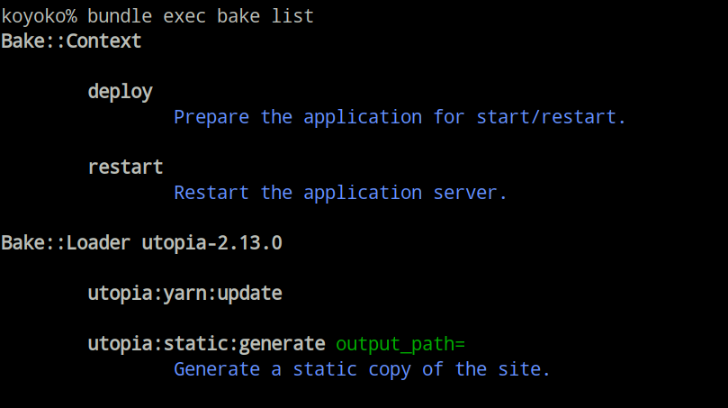

# Bake

Bake is a task execution tool, inspired by Rake, but codifying many of the use cases which are typically implemented in an ad-hoc manner.



## Motivation

Rake is an awesome tool and loved by the community. So, why reinvent it? Bake provides the following features that Rake does not:

- On demand loading of files following a standard convention. This avoid loading all your rake tasks just to execute a single command.
- Better argument handling including support for positional and optional arguments.
- Focused on task execution not dependency resolution. Implementation is simpler and a bit more predictable.
- Canonical structure for integration with gems.

That being said, Rake and Bake can exist side by side in the same project.

## Installation

Execute the following in your project:

	bundle add bake

## Usage

Bake follows similar patterns to Rake.

## Bakefile

There is a root level `bake.rb` which contains project-specific configuration and recipes, e.g.:

```ruby
recipe :cake do
	call 'supermarket:shop', 'flour,sugar,cocoa'
	call 'mixer:add', 'everything'
end
```

This file is project specific and is the only file which can expose top level tasks (i.e. without a defined namespace).

## Recipes

Alongside the `bake.rb`, there is a `recipes/` directory which contains files like `supermarket.rb`. These files contain recipes, e.g.:

```ruby
recipe :shop do |ingredients|
	supermarket = Supermarket.best
	supermarket.shop(ingredients.split(","))
end
```

## Gems

Adding a `recipes/` directory to your gem will allow other gems and projects to consume those recipes. In order to prevent collisions, you *should* prefix your commands with the name of the gem, e.g. in `mygem/recipes/mygem.rb`:

```ruby
recipe :setup do
	# ...
end
```

Then, in your project `myproject` which depends on `mygem`:

```
bake mygem:setup
```

## Contributing

1. Fork it
2. Create your feature branch (`git checkout -b my-new-feature`)
3. Commit your changes (`git commit -am 'Add some feature'`)
4. Push to the branch (`git push origin my-new-feature`)
5. Create new Pull Request

## See Also

- [Utopia](https://github.com/socketry/utopia) — A website framework which uses bake for maintenance tasks.

## License

Released under the MIT license.

Copyright, 2020, by [Samuel G. D. Williams](http://www.codeotaku.com).

Permission is hereby granted, free of charge, to any person obtaining a copy
of this software and associated documentation files (the "Software"), to deal
in the Software without restriction, including without limitation the rights
to use, copy, modify, merge, publish, distribute, sublicense, and/or sell
copies of the Software, and to permit persons to whom the Software is
furnished to do so, subject to the following conditions:

The above copyright notice and this permission notice shall be included in
all copies or substantial portions of the Software.

THE SOFTWARE IS PROVIDED "AS IS", WITHOUT WARRANTY OF ANY KIND, EXPRESS OR
IMPLIED, INCLUDING BUT NOT LIMITED TO THE WARRANTIES OF MERCHANTABILITY,
FITNESS FOR A PARTICULAR PURPOSE AND NONINFRINGEMENT. IN NO EVENT SHALL THE
AUTHORS OR COPYRIGHT HOLDERS BE LIABLE FOR ANY CLAIM, DAMAGES OR OTHER
LIABILITY, WHETHER IN AN ACTION OF CONTRACT, TORT OR OTHERWISE, ARISING FROM,
OUT OF OR IN CONNECTION WITH THE SOFTWARE OR THE USE OR OTHER DEALINGS IN
THE SOFTWARE.
